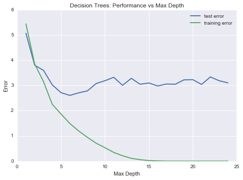

The following document was written interactively while executing an accompanying Python [script](https://github.com/joshuacook/boston_housing_data_model_development/blob/master/src/boston_housing.py). 

In order to run the script interactively, the main function was commented out.

```python
In [1]: %matplotlib inline
```

```python
In [2]: %run "../src/boston_housing.py"
```

## Load data

```python
In [3]: city_data = load_data()
```

## Statistical Analysis and Data Exploration

```python
In [4]: explore_city_data(city_data)
The number of data points in this set is 506.
The number of features in this set is 13.
The minimum value of the target feature, housing price, is 5.
The maximum value of the target feature, housing price, is 50.
The mean value of the target feature, housing price, is 22.5328.
The median value of the target feature, housing price, is 21.2000.
The standard deviation of the target feature, housing price, is 9.1880.
```

## Training/Test dataset split
```python
In [5]: X_train, y_train, X_test, y_test = split_data(city_data)
```

## Learning Curve Graphs
```python
In [6]: max_depths = [1,2,3,4,5,6,7,8,9,10]

In [7]: for max_depth in max_depths:
          learning_curve(max_depth, X_train, y_train, X_test, y_test)
```


\begin{figure}
  \centering
  \begin{minipage}[b]{0.49\textwidth}
    \includegraphics[width=\textwidth]{1_boston_housing_students_files/1_boston_housing_students_6_1.png}
    \caption{Decision Tree with Max Depth: 1 }
  \end{minipage}
  \hfill
  \begin{minipage}[b]{0.49\textwidth}
  \centering
  \includegraphics[width=\textwidth]{1_boston_housing_students_files/1_boston_housing_students_6_3.png}
  \caption{Decision Tree with Max Depth: 2 }
  \end{minipage}
\end{figure}


\begin{figure}
\begin{minipage}[b]{0.49\textwidth}
\centering
\includegraphics[height=2in]{1_boston_housing_students_files/1_boston_housing_students_6_5.png}
\caption{Decision Tree with Max Depth: 3 }
\end{minipage}
\hfill
\begin{minipage}[b]{0.49\textwidth}
\centering
\includegraphics[height=2in]{1_boston_housing_students_files/1_boston_housing_students_6_7.png}
\caption{Decision Tree with Max Depth: 4 }
\end{minipage}
\end{figure}

\begin{figure}
\begin{minipage}[b]{0.49\textwidth}
\centering
\includegraphics[height=2in]{1_boston_housing_students_files/1_boston_housing_students_6_9.png}
\caption{Decision Tree with Max Depth: 5 }
\end{minipage}
\hfill
\begin{minipage}[b]{0.49\textwidth}
\centering
\includegraphics[height=2in]{1_boston_housing_students_files/1_boston_housing_students_6_11.png}
\caption{Decision Tree with Max Depth: 6 }
\end{minipage}
\end{figure}

\begin{figure}
\begin{minipage}[b]{0.49\textwidth}
\centering
\includegraphics[height=2in]{1_boston_housing_students_files/1_boston_housing_students_6_13.png}
\caption{Decision Tree with Max Depth: 7 }
\end{minipage}
\hfill
\begin{minipage}[b]{0.49\textwidth}
\centering
\includegraphics[height=2in]{1_boston_housing_students_files/1_boston_housing_students_6_15.png}
\caption{Decision Tree with Max Depth: 8 }
\end{minipage}
\end{figure}

\begin{figure}
\begin{minipage}[b]{0.49\textwidth}
\centering
\includegraphics[height=2in]{1_boston_housing_students_files/1_boston_housing_students_6_17.png}
\caption{Decision Tree with Max Depth: 9 }
\end{minipage}
\hfill
\begin{minipage}[b]{0.49\textwidth}
\centering
\includegraphics[height=2in]{1_boston_housing_students_files/1_boston_housing_students_6_19.png}
\caption{Decision Tree with Max Depth: 10 }
\end{minipage}
\end{figure}


\pagebreak

\ \

\pagebreak

# Model Complexity Graph
```python
In [8]: model_complexity(X_train, y_train, X_test, y_test)
```



# Tune and predict Model
```python
In [9]: fit_predict_model(city_data)

Final Model: 
GridSearchCV(cv=None, error_score='raise',
       estimator=DecisionTreeRegressor(criterion='mse', max_depth=None, 
           max_features=None, max_leaf_nodes=None, min_samples_leaf=1, 
           min_samples_split=2, min_weight_fraction_leaf=0.0, presort=False, 
           random_state=None, splitter='best'),
       fit_params={}, iid=True, n_jobs=1,
       param_grid={'max_depth': (1, 2, 3, 4, 5, 6, 7, 8, 9, 10)},
       pre_dispatch='2*n_jobs', refit=True, scoring=None, verbose=0)
House: [11.95, 0.0, 18.1, 0, 0.659, 5.609, 90.0, 1.385, 
        24, 680.0, 20.2, 332.09, 12.13]
Prediction: [ 20.76598639]

In[10]: fit_predict_model(city_data)

Final Model: 
GridSearchCV(cv=None, error_score='raise',
       estimator=DecisionTreeRegressor(criterion='mse', max_depth=None, 
           max_features=None, max_leaf_nodes=None, min_samples_leaf=1, 
           min_samples_split=2, min_weight_fraction_leaf=0.0, presort=False, 
           random_state=None, splitter='best'),
       fit_params={}, iid=True, n_jobs=1,
       param_grid={'max_depth': (1, 2, 3, 4, 5, 6, 7, 8, 9, 10)},
       pre_dispatch='2*n_jobs', refit=True, scoring=None, verbose=0)
House: [11.95, 0.0, 18.1, 0, 0.659, 5.609, 90.0, 1.385, 
        24, 680.0, 20.2, 332.09, 12.13]
Prediction: [ 19.99746835]

In[11]: fit_predict_model(city_data)

Final Model: 
GridSearchCV(cv=None, error_score='raise',
       estimator=DecisionTreeRegressor(criterion='mse', max_depth=None, 
           max_features=None, max_leaf_nodes=None, min_samples_leaf=1, 
           min_samples_split=2, min_weight_fraction_leaf=0.0, presort=False, 
           random_state=None, splitter='best'),
       fit_params={}, iid=True, n_jobs=1,
       param_grid={'max_depth': (1, 2, 3, 4, 5, 6, 7, 8, 9, 10)},
       pre_dispatch='2*n_jobs', refit=True, scoring=None, verbose=0)
House: [11.95, 0.0, 18.1, 0, 0.659, 5.609, 90.0, 1.385, 
        24, 680.0, 20.2, 332.09, 12.13]
Prediction: [ 21.62974359]

In[12]: fit_predict_model(city_data)

Final Model: 
GridSearchCV(cv=None, error_score='raise',
       estimator=DecisionTreeRegressor(criterion='mse', max_depth=None, 
           max_features=None, max_leaf_nodes=None, min_samples_leaf=1, 
           min_samples_split=2, min_weight_fraction_leaf=0.0, presort=False, 
           random_state=None, splitter='best'),
       fit_params={}, iid=True, n_jobs=1,
       param_grid={'max_depth': (1, 2, 3, 4, 5, 6, 7, 8, 9, 10)},
       pre_dispatch='2*n_jobs', refit=True, scoring=None, verbose=0)
House: [11.95, 0.0, 18.1, 0, 0.659, 5.609, 90.0, 1.385, 
        24, 680.0, 20.2, 332.09, 12.13]
Prediction: [ 21.62974359]

In[13]: fit_predict_model(city_data)

Final Model:  
GridSearchCV(cv=None, error_score='raise',
       estimator=DecisionTreeRegressor(criterion='mse', max_depth=None, 
           max_features=None, max_leaf_nodes=None, min_samples_leaf=1, 
           min_samples_split=2, min_weight_fraction_leaf=0.0, presort=False, 
           random_state=None, splitter='best'),
       fit_params={}, iid=True, n_jobs=1,
       param_grid={'max_depth': (1, 2, 3, 4, 5, 6, 7, 8, 9, 10)},
       pre_dispatch='2*n_jobs', refit=True, scoring=None, verbose=0)
House: [11.95, 0.0, 18.1, 0, 0.659, 5.609, 90.0, 1.385, 
        24, 680.0, 20.2, 332.09, 12.13]
Prediction: [ 21.62974359]
```

# Evaluating Model Performance

- *Which measure of model performance is best to use for predicting Boston housing data and analyzing the errors?* 

  Scikit-learn has several built-in tools for quantifying the quality of prediction models. In this project, our target feature is a continuous variable, make the prediction of the variable a regression rather than classification problem. The following metrics are listed in the reference section:
    
  [`metrics.explained_variance_score(y_true, y_pred)`](http://scikit-learn.org/stable/modules/generated/sklearn.metrics.explained_variance_score.html#sklearn.metrics.explained_variance_score)	 
  Explained variance regression score function  
  [`metrics.mean_absolute_error(y_true, y_pred)`](http://scikit-learn.org/stable/modules/generated/sklearn.metrics.mean_absolute_error.html#sklearn.metrics.mean_absolute_error)	
  Mean absolute error regression loss  
  [`metrics.mean_squared_error(y_true, y_pred[, ...])`](http://scikit-learn.org/stable/modules/generated/sklearn.metrics.mean_squared_error.html#sklearn.metrics.mean_squared_error)	
  Mean squared error regression loss  
  [`metrics.median_absolute_error(y_true, y_pred)`](http://scikit-learn.org/stable/modules/generated/sklearn.metrics.median_absolute_error.html#sklearn.metrics.median_absolute_error)	
  Median absolute error regression loss  
  [`metrics.r2_score(y_true, y_pred[, ...])`](http://scikit-learn.org/stable/modules/generated/sklearn.metrics.r2_score.html#sklearn.metrics.r2_score)	
  R^2 (coefficient of determination) regression score function.   
   
  With little exposure to any of these, I chose to familiarize myself with the two metrics treated in the support material, mean absolute error and mean squared error, doing a little research into the topic. I found the following:
  
  > Both the root mean square error (RMSE) and the mean absolute error (MAE) are regularly employed in model evaluation studies.[^Chai]
  
[^Chai]: Chai, Tianfeng, and Roland R. Draxler. "Root mean square error (RMSE) or mean absolute error (MAE)?–Arguments against avoiding RMSE in the literature." Geoscientific Model Development 7.3 (2014): 1247-1250.

  > The mean absolute error ... is less sensitive to the occasional very large error because it does not square the errors in the calculation.[^rnau]
  
  > The root mean squared error is more sensitive than other measures to the occasional large error: the squaring process gives disproportionate weight to very large errors. If an occasional large error is not a problem in your decision situation (e.g., if the true cost of an error is roughly proportional to the size of the error, not the square of the error), then the MAE or MAPE may be a more relevant criterion.
    
  > There is no absolute criterion for a "good" value of RMSE or MAE: it depends on the units in which the variable is measured and on the degree of forecasting accuracy, as measured in those units, which is sought in a particular application. Depending on the choice of units, the RMSE or MAE of your best model could be measured in zillions or one-zillionths. It makes no sense to say "the model is good (bad) because the root mean squared error is less (greater) than x", unless you are referring to a specific degree of accuracy that is relevant to your forecasting application.[^Hyndmand_Koehler]
  
[^rnau]: http://people.duke.edu/~rnau/compare.htm


[^Hyndmand_Koehler]: Hyndman, Rob J., and Anne B. Koehler. "Another look at measures of forecast accuracy." International journal of forecasting 22.4 (2006): 679-688.
  
- Why do you think this measurement most appropriate? 
  
   > If an occasional large error is not a problem in your decision situation (e.g., if the true cost of an error is roughly proportional to the size of the error, not the square of the error), then the MAE or MAPE may be a more relevant criterion.[^rnau]
   
   This seems to fit with the data we are looking at so I chose to go with the Mean Absolute Error as my performance metric. 
   

- *Why might the other measurements not be appropriate here?*  

  Explained variance is primarily aimed at principal component analysis. Furthermore, we shouldn't use classfication or clustering metrics on this problem, a regression.

- *Why is it important to split the Boston housing data into training and testing data? What happens if you do not do this?*

  We use training data to form the model and testing data to assess the validity of the model. If we did not reserve some of our data for testing then when we used data to test the validity, this data would have been used in the formation of the model. We would expect any data that had been used to form the model to fit the model well. With test data we can see how well data not used to form the model fits with the model that was formed.

- *What does grid search do and why might you want to use it?*

  Grid search takes a given model and a set of parameters and compares the performance of the model against each of the parameters in sequence. The goal is to fine-tune the model against the parameters, finding the parameter against which the model performs best. 

- *Why is cross validation useful and why might we use it with grid search?*

  Cross validation is a process by which a training set of data is split into $K$ sets. A train-test analysis is then performed against these sets reserving a different individual set as the test set in each pass. Using cross validation with grid search effectively multiplies the number of validation analyses performed against our model. 


### 3) Analyzing Model Performance

- *Look at all learning curve graphs provided. What is the general trend of training and testing error as training size increases?*

  Generally speaking, both training and testing error rapidly decrease as $n\to50$ and then slowly decrease as the remaining data points are added to the analysis.
  
- *Look at the learning curves for the decision tree regressor with max depth 1 and 10 (first and last learning curve graphs). When the model is fully trained does it suffer from either high bias/underfitting or high variance/overfitting?*

  The error is clearly diminished for a depth of 10, though it is unclear whether a depth of 10 is significantly better than say a depth of 5. A depth of 5 is certainly better than a depth of 1. 

- *Look at the model complexity graph. How do the training and test error relate to increasing model complexity? Based on this relationship, which model (max depth) best generalizes the dataset and why?*
 
  It would appear that the test data error has a minimum near a depth of 6. Based upon this the error would decrease as depth increases until the depth of 6, after which it would increase, suffering from over fitting. 

### 4) Model Prediction

- *Model makes predicted housing price with detailed model parameters (max depth). Note due to the small randomization of the code it is recommended to run the program several times to identify the most common/reasoable price/model complexity.*
- *Compare prediction to earlier statistics and make a case if you think it is a valid model.*

  The final prediction is run against this data point and returns the shown value.
  
  ```
  House: [11.95, 0.0, 18.1, 0, 0.659, 5.609, 90.0, 1.385, 24, 680.0, 20.2, 332.09, 12.13]
  Prediction: [ 21.62974359]
  ```
  
  It is difficult to look at the original data set and speculate as the validity of this answer. As humans, we have little intuition for an 11-dimensional domain. That said, the process throuch which we generated this response was a reasonable one, involving both cross-validation and grid search. As such, I have a high degree of faith in this response. 


```python

```
